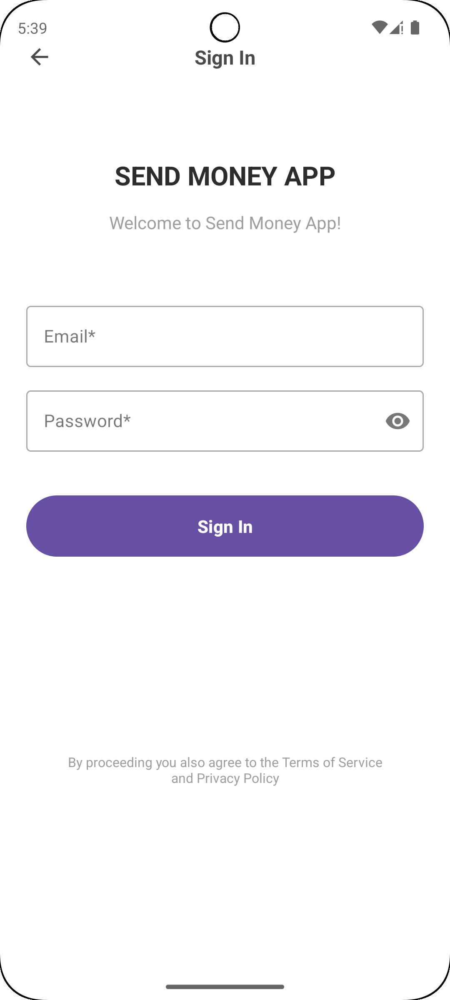
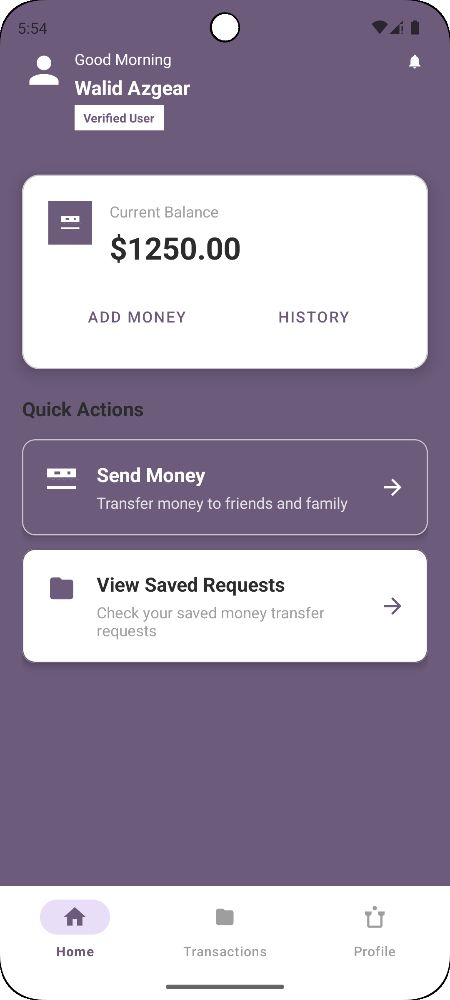
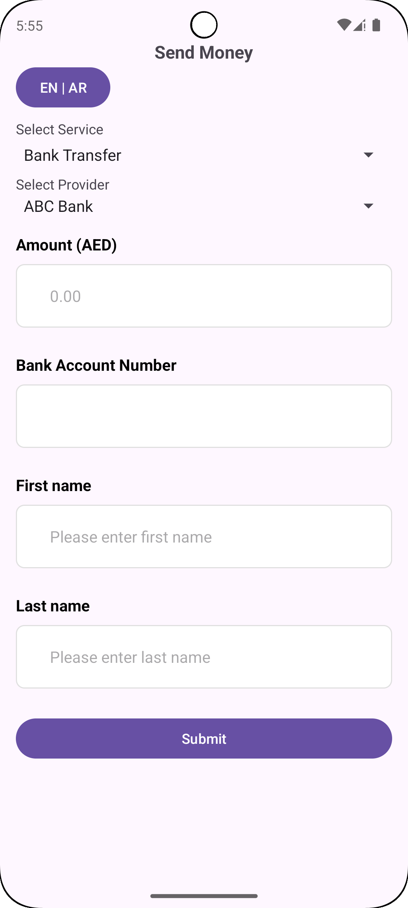

# SendMoney App

A dynamic Android application for sending money with support for multiple services and providers, featuring a dynamic form builder and comprehensive validation system.

## 🚀 Features

### Core Functionality
- **Dynamic Send Money Screen**: Displays services, providers, and input fields based on JSON configuration
- **Multi-Service Support**: Bank Transfer, Wallet Transfer, and more
- **Provider Selection**: Multiple providers per service with specific field requirements
- **Dynamic Form Generation**: Forms built automatically based on selected service and provider

### Form Features
- **Field Types Support**: Text, Number, Option (dropdown), MSISDN (phone), Date
- **Real-time Validation**: Immediate feedback on input validation
- **Custom Validation**: Regex patterns and max length validation from JSON
- **Localization**: English and Arabic language support with runtime switching

### User Experience
- **Progressive Form Building**: Clean interface until provider selection
- **Validation Error Display**: Clear error messages below each field
- **Responsive Design**: Modern Material Design UI following Android principles

## 📱 Screenshots

The app includes several key screens with a modern, clean design:

### Sign In Screen

- Clean authentication interface with email and password fields
- Modern purple accent design with "SEND MONEY APP" branding
- Password visibility toggle and form validation

### Home Dashboard

- Personalized greeting with user verification badge
- Current balance display with wallet icon
- Quick action cards for Send Money and View Saved Requests
- Bottom navigation with Home, Transactions, and Profile tabs

### Send Money Form

- Dynamic form with service and provider selection dropdowns
- Real-time form validation with error messages
- Language toggle (EN | AR) for English/Arabic support
- Progressive form building based on selected service and provider

The app features:
- **Send Money Screen**: Dynamic form with service/provider selection
- **Confirmation Screen**: Transaction review before final submission
- **Transactions Screen**: List of all submitted requests with JSON details view

## 🏗️ Architecture

### Technology Stack
- **Language**: Kotlin
- **Architecture**: MVVM with Repository pattern
- **UI**: XML layouts with Data Binding
- **State Management**: Kotlin Flow and StateFlow
- **Navigation**: Navigation Component
- **Build System**: Gradle with Kotlin DSL

### Project Structure
```
app/src/main/java/com/azgear/sendmoney/
├── core/
│   ├── base/           # Base classes and extensions
│   ├── extensions/     # View and lifecycle extensions
│   └── utils/          # Utility classes (FormBuilder, Validation, etc.)
├── modules/
│   ├── sendmoney/      # Main send money functionality
│   ├── confirmation/   # Transaction confirmation
│   ├── transactions/   # Saved requests management
│   ├── home/          # Home screen
│   ├── profile/       # User profile
│   ├── auth/          # Authentication
│   └── splash/        # Splash screen
```

## 🔧 Setup & Installation

### Prerequisites
- Android Studio Arctic Fox or later
- Android SDK 21+
- Kotlin 1.5+

### Installation Steps
1. Clone the repository
   ```bash
   git clone https://github.com/yourusername/SendMoney.git
   ```

2. Open the project in Android Studio

3. Sync Gradle files and build the project

4. Run on device or emulator

## 📊 JSON Configuration

The app uses a JSON configuration file (`send_money_services.json`) to define:
- Services and their labels
- Providers for each service
- Required fields with validation rules
- Localization support (English/Arabic)

### Example JSON Structure
```json
{
  "title": {
    "en": "Send Money",
    "ar": "إرسال الاموال"
  },
  "services": [
    {
      "label": {
        "en": "Bank Transfer",
        "ar": "تحويل بنكي"
      },
      "name": "bank_transfer",
      "providers": [
        {
          "name": "ABC Bank",
          "id": "101",
          "required_fields": [
            {
              "label": {
                "en": "Amount (AED)",
                "ar": "المبلغ (درهم)"
              },
              "name": "amount",
              "type": "number",
              "validation": "",
              "max_length": 0
            }
          ]
        }
      ]
    }
  ]
}
```

## 🧪 Testing

### Manual Testing
1. **Service Selection**: Select different services to see provider options
2. **Provider Selection**: Choose providers to see dynamic form fields
3. **Form Validation**: Test various input scenarios and validation rules
4. **Language Switching**: Toggle between English and Arabic
5. **Form Submission**: Complete forms and verify navigation flow

### Test Scenarios
- Empty field validation
- Invalid format validation (phone, email, date)
- Max length validation
- Regex pattern validation
- Language switching with form data
- Navigation between screens

## 🔒 Security Features

- **Input Validation**: Comprehensive client-side validation
- **Data Sanitization**: Proper handling of user input
- **Secure Storage**: Local data storage with proper access controls

## 🌐 Localization

The app supports:
- **English**: Primary language
- **Arabic**: Right-to-left (RTL) support
- **Runtime Switching**: Change language without app restart
- **Localized Content**: All text, error messages, and placeholders

## 👥 Team

- **Developer**: Walid Azgear
- **Project**: SendMoney App
- **Version**: 1.0.0


- Contact: [azgearwalid@gmail.com]

---

**Note**: This app is designed as a demonstration of dynamic form building, validation, and modern Android development practices. It includes comprehensive error handling, localization support, and follows Material Design guidelines. 